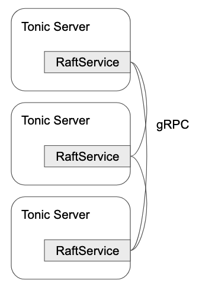

# Architecture

lol fully depends on [Tonic](https://github.com/hyperium/tonic) and
Tonic is a library to build a gRPC server on top of [Hyper](https://github.com/hyperium/hyper).

To build a gRPC application on top of Tonic,
user has to implement a `tower::Service` which is generated from a Proto file
describing the service.

lol offers `RaftService` which is a Raft implementation of the `tower::Service`.
With the user application which implements `RaftApp`,
`RaftService` is made.



```rust
let raft_service = lol_core::make_raft_service(app, ...).await;
let mut builder = tonic::transport::Server::builder();
builder
	.add_service(raft_service)
	.serve(socket)
	.await
```

In Raft, log entries are replicated across the nodes and snapshot is
copied when it is needed.
To implement these peer-to-peer communications, lol uses gRPC's streaming API for the best efficiency.
Another optimization is that it reduces copies of the message payloads with the help of [serde-bytes](https://github.com/serde-rs/bytes)
and prost's [bytes](https://docs.rs/prost-build/latest/prost_build/struct.Config.html#method.bytes) configuration.

```rust
service Raft {
    rpc SendAppendEntry (stream AppendEntryReq) returns (AppendEntryRep);
    rpc GetSnapshot (GetSnapshotReq) returns (stream GetSnapshotRep);
```

