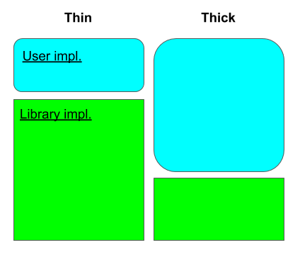

# lol-core

A Raft implementation with thin abstraction layer.

## Features

- Simple abstraction that is easy to understand and implement.
- Log compaction and log applying to state machine never block each other.
- Servers communicate with each other by gRPC.
- No InstallSnapshot RPC.
- Online configuration change. (Not by joint consensus but by single-server changes)
- Optimized replication and concurrency.
- Leadership Transfer (TimeoutNow RPC).

## Design

### Thin and Thick abstraction



We recognize the prior arts like [raft-rs](https://github.com/tikv/raft-rs) and [async-raft](https://github.com/async-raft/async-raft) and find their designs are very similar. We call this **Thick abstraction** because the abstraction layer (typically called RaftStorage) is thick enough to include everything like log structure, snapshotting mechanism and storing most recent vote. Some of them also abstract networking so testing becomes deterministic and choice of networking backend are left to users.

However, the thicker the abstraction is the more frequent the common layer and the abstraction layer communicate through the abstracted interface. This makes runtime inefficient in some cases and also error handling is likely to be imperfect.

Our library called **lol** goes different: the abstraction is thin and the common layer includes log structure, snapshot and so on. App implementor needs to implement `RaftApp` only and everything else is fully managed by the library.

```rust
pub trait RaftApp: Sync + Send + 'static {
    async fn apply_message(&self, request: Message) -> anyhow::Result<Message>;
    async fn install_snapshot(&self, snapshot: Snapshot) -> anyhow::Result<()>;
    async fn fold_snapshot(
        &self,
        old_snapshot: Snapshot,
        requests: Vec<Message>,
    ) -> anyhow::Result<Snapshot>;
}
```

### Snapshot as a log entry

Unlike other Raft libraries, lol manages snapshot in the library part and it is just a log entry that other normal entries follow. This choice reduces the implementation complexity by eliminating InstallSnapshot RPC. This implementation is referred in Raft thesis $5.4.1 "Storing snapshots in the log".

### Comparison

There are pros/cons between the designs.

- Ease of use: Thin abstraction wins. All you need to do is implement simple abstraction called `RaftApp`. kvs/ is a good implementation example.
- Performance: Draw. General rule is the thicker stack performs well because of the strong coupling within the stack. With this rule, thin abstraction performs well in the common layer and the thick abstraction does good in the abstraction layer. Let's think of snapshotting as an example, as thick abstraction includes snapshotting in the abstraction layer, more efficient snapshotting can be implemented (like by exploiting storage functionality or cloning the current state machine).
- Versatility: Thick abstraction wins.

Our recommendation is: if the app you try to implement is something like storage or database that the snapshot is gigabytes or more then choose thick abstraction and what you need is efficient log replication mechanism rather than gigantic state machine replication, lol is the way to go.

## Future works

- Persistency: lol stores all data in memory now but this is to vulnable to catastrophic senario. User should be able to choose between in-memory or disk-based as the storage medium. Choice of in-memory storage is referred in Raft thesis $11.7.3 "Avoid persistent storage writes".
- Stacking thin abstraction on top of thick abstraction: If there finds a good surface to cut out the thick abstraction surface, that would be cool.
- More efficient form of snapshot: Now snapshot is just a `Vec<u8>`. This is too inefficient especially in term of memory efficiency because RaftApp typically needs temporary memory allocation in `install_snapshot` and `fold_snapshot`. As a result, the maximum memory RaftApp can use as snapshot is reduced. Also, if the compaction happens too often the serializer's overhead would be non-negligible. This could be done by defining `RaftApp::Snapshot` associated type.